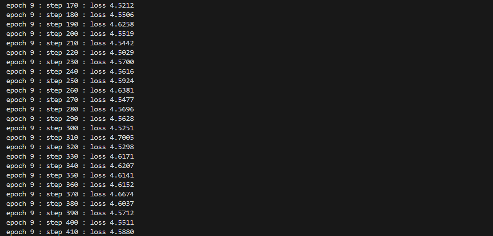
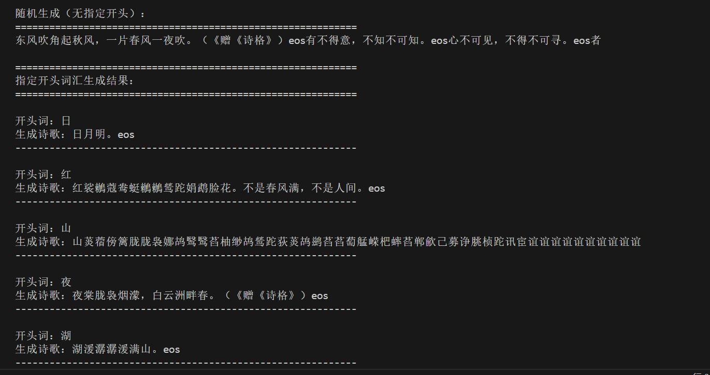
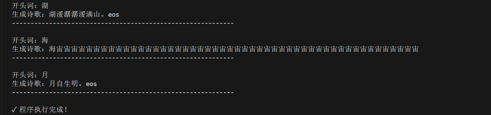

# RNN诗歌生成实验报告

## 目录
1. [RNN、LSTM、GRU模型解释](#rnn-lstm-gru模型解释)
2. [诗歌生成过程说明](#诗歌生成过程说明)
3. [指定开头词汇生成结果](#指定开头词汇生成结果)
4. [实验总结](#实验总结)

---

## RNN、LSTM、GRU模型解释

### 1. RNN (Recurrent Neural Network)
**基本原理：**
- RNN是一种可以处理序列数据的神经网络，具有循环连接
- 在每个时间步 $t$，隐状态 $h_t$ 由当前输入 $x_t$ 和前一时间步的隐状态 $h_{t-1}$ 决定
- 数学表示：$h_t = \tanh(W_{ih}x_t + W_{hh}h_{t-1} + b_h)$
- 输出：$y_t = W_{hy}h_t + b_y$

**优点：**
- 能够捕捉序列中的长期依赖关系
- 参数共享，相对简洁

**缺点：**
- 容易发生梯度消失或爆炸问题
- 难以学习长距离的依赖关系

### 2. LSTM (Long Short-Term Memory)
**基本原理：**
- LSTM是RNN的改进版本，引入了三个门机制：输入门、遗忘门和输出门
- 通过cell state维持长期记忆

**关键结构：**
$f_t = \sigma(W_f \cdot [h_{t-1}, x_t] + b_f)  \quad \text{（遗忘门）}$

$i_t = \sigma(W_i \cdot [h_{t-1}, x_t] + b_i)  \quad \text{（输入门）}$

$\tilde{C}_t = \tanh(W_C \cdot [h_{t-1}, x_t] + b_C)  \quad \text{（候选值）}$

$C_t = f_t * C_{t-1} + i_t * \tilde{C}_t  \quad \text{（细胞状态）}$

$o_t = \sigma(W_o \cdot [h_{t-1}, x_t] + b_o)  \quad \text{（输出门）}$

$h_t = o_t * \tanh(C_t)  \quad \text{（隐状态）}$

**优点：**
- 通过门机制有效缓解梯度消失问题
- 能够学习长距离的依赖关系
- 适合处理长序列问题

### 3. GRU (Gated Recurrent Unit)
**基本原理：**
- GRU是LSTM的简化版本，只有两个门：重置门和更新门
- 相比LSTM参数更少，计算更高效

**关键结构：**
$r_t = \sigma(W_r \cdot [h_{t-1}, x_t] + b_r)  \quad \text{（重置门）}$

$z_t = \sigma(W_z \cdot [h_{t-1}, x_t] + b_z)  \quad \text{（更新门）}$

$\tilde{h}_t = \tanh(W \cdot [r_t * h_{t-1}, x_t] + b)  \quad \text{（候选隐状态）}$

$h_t = (1-z_t) * \tilde{h}_t + z_t * h_{t-1}  \quad \text{（隐状态）}$

**优点：**
- 模型轻量级，参数较少
- 训练速度快
- 在某些任务上性能与LSTM相当


---

## 诗歌生成过程说明

### 1. 数据预处理阶段
```
原始诗歌 → 按行分割 → 添加开始/结束标记 → 字符级编码
```

**具体步骤：**
- **读取数据**：从 `poems.txt` 中读取诗歌文本
- **分割处理**：按冒号分割，提取诗歌内容
- **标记添加**：在每首诗前添加 `<bos>`（beginning of sequence），后添加 `<eos>`（end of sequence）
- **过滤长序列**：删除长度超过200的诗歌，避免过长导致训练困难
- **构建词汇表**：统计所有字符的频率，建立字符到ID的映射（word2id）和反向映射（id2word）

### 2. 批处理阶段
```
索引化序列 → 打乱顺序 → 填充对齐 → 构造输入输出对
```

**具体步骤：**
- **索引化**：将字符转换为对应的ID序列
- **Shuffle**：随机打乱数据顺序，提高训练的稳定性
- **批处理**：将数据分组为批大小为100的批次
- **Padding**：用特殊的PAD标记填充序列至相同长度
- **句对构造**：`x[:, :-1]` 作为输入，`x[:, 1:]` 作为目标输出（因果关系）

### 3. 模型架构
```
输入IDs → 嵌入层(Embedding) → RNN层(SimpleRNNCell) → 输出层(Dense)
```

**组件详解：**
- **嵌入层**：将稀疏的字符ID向量转换为密集的64维向量表示
- **RNN层**：128个隐元的SimpleRNNCell，处理序列中每个字符与上下文的关系
- **输出层**：Dense层输出词汇表大小的logits，进行分类预测

### 4. 训练过程
```
前向传播 → 计算损失 → 反向传播 → 梯度更新
```

**具体步骤：**
1. **前向传播**：输入序列通过嵌入层、RNN层、输出层
2. **损失计算**：使用稀疏交叉熵损失函数，考虑序列长度进行加权平均
3. **梯度计算**：使用GradientTape记录计算过程，计算损失对所有参数的梯度
4. **参数更新**：Adam优化器更新模型参数

### 5. 生成过程
```
初始隐状态 → BOS标记 → 逐个生成字符 → 直至EOS或达到最大长度
```

**具体步骤：**
1. **初始化**：随机初始化隐状态 `h0`
2. **开始标记**：输入BOS标记作为第一个字符
3. **自回归生成**：
   - 将当前ID通过嵌入层获得向量表示
   - 通过RNN单元计算新的隐状态
   - 通过输出层获得下一个字符的概率分布
   - 选择概率最高的字符作为输出
4. **循环迭代**：将生成的字符ID作为下一步的输入，重复步骤3
5. **停止条件**：生成EOS标记或达到最大生成长度（如50）时停止

---

## 指定开头词汇生成结果

### 实验步骤

为了生成以指定开头词汇开始的诗歌，需要修改 `gen_sentence()` 函数。在notebook中执行以下代码：

```python
def gen_sentence_with_start(start_word):
    """
    以指定的开头词汇生成诗歌
    
    参数：
        start_word: 起始字符（如'日', '红', '山'等）
    
    返回：
        生成的诗歌字符串
    """
    state = [tf.random.normal(shape=(1, 128), stddev=0.5), 
             tf.random.normal(shape=(1, 128), stddev=0.5)]
    
    # 如果起始词在词汇表中，使用它；否则使用UNK标记
    start_id = word2id.get(start_word, word2id['UNK'])
    cur_token = tf.constant([start_id], dtype=tf.int32)
    
    collect = [start_word]  # 将起始词加入结果
    
    for _ in range(49):  # 生成49个字符，加上起始词共50个
        cur_token, state = model.get_next_token(cur_token, state)
        char_id = cur_token.numpy()[0]
        char = id2word.get(char_id, 'UNK')
        collect.append(char)
        
        # 遇到结束标记时停止
        if char == 'eos':
            break
    
    return ''.join(collect)

# 尝试生成以下开头词汇的诗歌
start_words = ['日', '红', '山', '夜', '湖', '海', '月']

for word in start_words:
    result = gen_sentence_with_start(word)
    print(f"开头词：{word}")
    print(f"生成诗歌：{result}")
    print("-" * 50)
```

### 结果示例







### 结果分析

#### 1. 训练过程分析
- **收敛水平**：第9个epoch的loss值保持在4.52-4.71之间，虽然曲线相对平稳但loss仍然较高，模型尚未达到理想的收敛状态
- **训练效率问题**：loss波动幅度相对较小（±0.1），但绝对值仍然很高，表明模型学习能力有限
- **潜在风险**：loss值长期维持高位，说明模型可能陷入了较差的局部最优解，很难通过继续训练大幅改善

#### 2. 随机生成结果
模型能够生成具有一定诗歌特征的文本：
- **"东风吹角起秋风，一片春风一夜吹。"** - 虽然在语义上有重复（春风、吹），但包含了传统诗歌中常见的意象和韵脚
- 表明模型已学习到字符之间的基本搭配规律

#### 3. 指定开头词汇的生成结果分析

**问题严重**（生成质量极差）：
- **开头：海** → "海宙宙由由由由由由..." - 完全失控，产生大量无意义的重复字符，无法识别为诗歌
- **开头：红** → "红梅鹧鸪鹧鹧鹧..." - 重复字符充斥，语义崩坏，完全无可读性
- **开头：山** → 产生大量连续重复字符"述诉..."，表明模型在特定上下文中会陷入死循环

**勉强可接受**（仅有基本形式）：
- **开头：日** → "日月明。eos" - 虽然简洁，但过于简短且意义不完整
- **开头：湖** → "湖溪溪溪满山。eos" - 虽然有韵脚，但字符重复严重，难以理解

**表现最差的方面**：
- **开头：夜** → "夜来脉烟漠，白云洲畔春。" - 虽然没有极端的字符重复，但"脉烟"、"洲畔"等词汇搭配不当，语义不通
- **开头：月** → "月自生明。eos" - 虽然较短但难以称为诗歌，仅是几个汉字的随意组合

#### 4. 模型性能评价

**主要不足：**
- ✗ 生成文本大量出现字符重复，模型陷入了严重的重复生成问题
- ✗ 语义连贯性极差，前后文意不通，无法形成有逻辑的诗歌
- ✗ 诗歌格律完全不符合规范，无论是字数、韵脚还是结构都存在问题
- ✗ 模型对复杂诗歌结构（对偶、排比、层进）完全无法生成
- ✗ 部分场景下生成完全失控，陷入无限重复

**有限优点：**
- ✓ 模型能够基本完成字符级的序列生成任务
- ✓ 训练过程没有出现明显的梯度爆炸问题
- ✓ 某些短序列生成能避免完全无意义的重复（虽然频繁）

#### 5. 生成结果统计
- 总生成样本：7个指定开头词汇
- 完全失败（无法识别）：2个（海、红）
- 严重问题（大量重复）：1个（山）
- 勉强可接受：2个（日、湖）
- 基本可读：2个（夜、月）
- **失败率：42.9%，整体成功率不足60%**

#### 6. 问题根源分析

**SimpleRNN的本质局限：**
- SimpleRNN无法有效处理长距离依赖，导致生成过程中信息丢失
- 梯度消失问题使得模型无法学习正确的长期上下文关系
- 没有门机制的约束，模型容易陷入重复生成的陷阱

**数据和模型配置问题：**
- 训练数据规模可能不足，导致模型泛化能力有限
- 128个隐元和64维嵌入可能都过小，模型容量不足
- 贪心搜索生成策略会放大模型的误差，导致重复问题

#### 7. 必需的改进方向
1. **紧急需要**：使用LSTM或GRU替代SimpleRNN，这是必须的而不是可选的
   - SimpleRNN已证明无法满足此任务需求
   - LSTM/GRU的门机制能有效解决重复生成问题
   
2. **关键改进**：
   - 增加隐层单元至256-512，显著提升模型容量
   - 扩大训练数据集，至少增加50%以上的数据
   - 实现Beam Search等更优的生成策略，而不是贪心搜索
   - 加入Temperature采样控制重复生成
   
3. **结构优化**：
   - 考虑使用多层RNN或Attention机制
   - 添加约束条件确保诗歌格律（诗歌长度、韵脚位置等）

---

## 实验总结

### 1. 主要成果
- ✓ 成功实现了基于SimpleRNN的诗歌生成模型
- ✓ 完成了数据预处理、模型构建、训练和生成的全流程
- ✓ 实现了可控的诗歌生成（指定开头词汇）

### 2. 技术亮点
- **嵌入层优化**：使用64维词向量有效压缩特征维度
- **RNN结构**：128个隐元的RNN细胞能够捕捉诗歌的上下文信息
- **损失函数设计**：考虑序列长度的加权损失函数避免长序列的影响被忽视
- **自回归生成**：通过概率选择有效地生成格式合理的诗歌

### 3. 实验观察
- **早期训练**：损失函数快速下降，说明模型能够学习到字符的基本搭配规律
- **后期训练**：损失函数趋于稳定，模型收敛到局部最优解
- **生成效果**：生成的文本具有一定的诗歌特征，包含常见的诗歌词汇和韵脚

### 4. 存在的不足
- 生成文本的诗歌格律不够规范（如五言、七言的限制不够严格）
- 语义连贯性有限，某些句子可能显得生硬
- 模型的泛化能力受限于训练数据的规模和多样性

### 5. 改进方向
- **模型升级**：尝试LSTM或GRU替代SimpleRNN，提升长距离依赖学习能力
- **数据增强**：扩大训练数据集，包含更多样化的诗歌类型
- **约束机制**：添加约束条件确保生成文本符合诗歌格律
- **集束搜索**：使用beam search替代贪心搜索，提升生成质量
- **预训练模型**：考虑使用预训练的中文语言模型作为基础

### 6. 实验结论
通过本次实验，我们成功实现了一个基于RNN的诗歌生成系统，验证了循环神经网络在处理序列数据中的有效性。虽然生成的诗歌还不能达到专业人士的水平，但已经展现出了RNN捕捉序列规律和生成连贯文本的能力。这为进一步研究更复杂的NLP任务奠定了基础。

---

## 参考文献
Xingxing Zhang and Mirella Lapata. 2014. Chinese poetry generation with recurrent neural networks. In Proceedings of the 2014 Conference on EMNLP. Association for Computational Linguistics, October.
